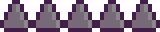

# Gravity Up&Down
> Semester project for B0B36PJV (Programming in Java) course at Czech Technical University.


**Gravity Up&Down** is a desktop platform game written in Java using the Java Swing library. The game's objective is to move the player character from the starting point of a level to the end. Every level features several spikes that a player should avoid. Various collectables are scattered around the level — power-ups that can help a user to pass the level. A distinctive feature of the game is the ability to flip gravity so that the hero can move upside down.

The user can create, edit, and play his own levels. **Tilemaps** technique is used to store information about objects.

## Screenshots
|Main Menu | Gameplay |
| ------ | ------ |
|  |  |

## User Manual
### Main Menu
After starting the game, a user will see the main menu with four buttons:

* **New Game**: starts a new game from the very first level
* **High Score**: shows a list of high scores earned during previous playthroughs
* **Settings**: allows the user to disable music and/or sound effects
* **Exit**: exits the game

### Gameplay
The game consists of several levels, and the user starts from Level 1. The game's objective is to complete all levels, and the goal of each level is to reach the end of the level. 

The idea of the game is that the user controls the main hero by changing the gravity. However, the hero moves along the horizontal axis himself - he constantly moves from one side to another until he reaches a wall and bounces off it, starting to move in the opposite direction.

At the beginning of the game, the player will see instructions on how to play:
| Instructions |
| ------ |
|  |

In addition to static platforms and walls, there are:
| Image | Entity | Description |
| ------ | ------ | ------ |
|  | **Spikes** | A user should avoid these because when he hits the spike, he will have to start the level from the beginning (or a checkpoint) |

There are different power-ups scattered on each level to help the player:
| Icon | Type | Description | How To Use |
| ------ | ------ | ------ | ------ |
|  | **Checkpoint** | Saves the current position of the player. Allows starting the game from the control point instead of starting from the very beginning in case of dying or hitting spikes | When the player collects the Checkpoint power-up, the game automatically creates a savepoint that has a position of the power-up |
|  | **Extra flips** | Normally, the player can flip gravity just two times until he reaches the platform again. Collecting this power-up adds five more one-off flips. | Press the `SPACE` button mid-air to use this power-up and to flip the gravity |
|  | **Bounce power-up** | Enables the player to change once the direction of movement of the hero, so he doesn't have to wait for the hero to bounce from the nearest wall.| Press the `CTRL` button to change the direction of movement |
|  | **Anti-spike power-up**| Temporarily (for 5 seconds) disables spikes, so a player will just go through them and won't die. | No need to press any button — the countdown (5 secs) starts from the moment the player collects the power-up |

Each level has a time limit to encourage the user to think and act faster. After this time, the level is considered failed, and the player must start over.

Playing a level user can see a number of remaining flips/bounces and remaining time on a screen. 

The player can pause the game at any time. The pause menu allows to restart the level, leave it, or continue.

## Used Formats
### Autosave Format
The game uses a simple JSON file to save and load the game's data. This file has the name `gravity-autosave.json` and has the following structure:

```json
{
  "score" : "12125",
  "level" : "1",
  "active" : "true"
}
```


* `score`: total earned point
* `level`: index of a level to resume from
* `active` whether the autosave should be used or not


### Level Format
Each level uses [TMX format](https://doc.mapeditor.org/en/stable/reference/tmx-map-format/#tmx-map-format). TMX is the format used by [Tiled](https://www.mapeditor.org/) (the 2D level editor that simplifies the creation of levels for end players) for storing tile maps, based on XML. TMX provides a flexible way to describe a tile-based map.

Each level has several layers:
* `map`: contains static walls
* `bounce`: contains bounce tiles
* `spikes`: contains spikes
* `decoration`: contains end zone ('end of the level' portal)

Then there is a layer of objects that contains:
* **Texts**: these are drawn over a tilemap
* **Power-ups**: of several types mentioned earlier
* **Player Object**: denotes an initial position of the player
* **End Zone**: marks an "end zone" - an area that a user should reach to complete a level

The objects mentioned above should have given names so that a game could identify them:
* **Player Object**: `"player"`
* **End Zone**: `"end_zone"`

Object names for power-ups are following:
* **Checkpoint**: `"powerup_save"`
* **Extra flips**: `"powerup_flip"`
* **Bounce power-up**: `"powerup_bounce"`
* **Anti-spike power-up**: `"powerup_smash"`

A person should specify the time limit (in seconds) for a certain level in the `time_limit` property of the map.


The **TMX format** was chosen because it facilitates a player to design, create and edit levels the fastest way. It is much easier than editing some format "manually". Here's a showcase of *Tiled* software that is used to create and edit levels for **Gravity Up&Down**
| Level 2 | Level 0 (Intro)|
| ------ | ------ |
|  |  |


## Class Diagram
| engine (package) | game (package) |  All Classes |
| ------ | ------ | ------ |
|  |  |  |

### First draft of the model
The app is implemented with an MVC pattern to separate a model (and computations) and view (rendering).

**App** class initializes a main **GameLoop** that contains a method _handle()_ which is called approximately every 1/60 of a second. **GameLoop** itself uses _GameStateManager_ and _GameStateManager.update()_ method to update models data and _GameStateManager.draw()_ to draw objects on the screen after that.

The game will use a canvas to render all objects.


## Authors
[Kirill Khakimov](https://github.com/khakim0v) - project founder and the only developer so far :)
